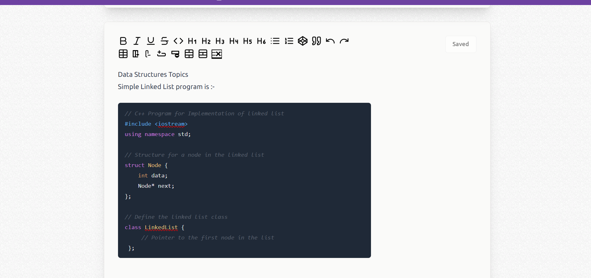

# NoteAssistant

## Description
A note taking website with AI features which lets you customize notes.

## Need
The vision for the project is to explore and learn new technologies, such as Next.js, Hugging Face, and PineCone, while developing a highly customizable note-taking application that serves as a virtual sticky notes board. Our goal is to integrate AI-driven features to enhance the user experience, streamline workflows, and minimize the time spent searching for information.

## Features
1. **Chatbot Integration**: A built-in chatbot will allow you to ask questions based on your saved notes. This feature helps retrieve information quickly, saving you valuable time and effort when searching for specific details.
2. **Text Autocompletion**: Enhance your note-taking experience with an autocompletion feature that predicts and suggests text based on your recent input. This streamlines the writing process, making it faster and more efficient.
3. **Customizable Note Appearance**: Organize your notes visually by applying color codes to distinguish between tasks or categories. You can also personalize your notes by uploading custom cover images or generating unique designs using AI.
4. **Privacy with Authentication**: The application integrates Clerk Auth for secure user authentication, ensuring your notes remain private and accessible only to you.
5. **Rich Formatting Options**: Create detailed and structured notes by adding tables and code blocks. Syntax highlighting supports multiple programming languages, making the app suitable for technical and non-technical users alike.
6. **Advanced Search Functionality**: Quickly find notes by searching both titles and content. This feature significantly reduces the time spent looking up information.
7. **Responsive Design and Shortcuts**: The application is designed to be fully responsive, ensuring a seamless user experience across devices. Additionally, keyboard shortcuts are supported to improve accessibility and ease of use.
8. **Favorites for Quick Access**: Mark important notes as favorites for quick and easy access, ensuring that frequently used notes are always at your fingertips.

## Tech Stack
- UI/Backend :- Next.JS, Tailwind CSS(Shadcn), Material UI, Prisma Client
- Database :- MongoDB, PineCone
- AI :- Huggingface Inference API
- Cloud Data Storage :- Upload Thing
- Authentication :- Clerk Auth

## Execute the project
1. Install packages
- npm i or npm i --force (if failing due version mismatch)

2. Command to initialize prisma client (Do it after each change in the schema)
- npx prisma generate

3. Commands to run 
- npm run dev
- site hosted on http://localhost:3000

## Screenshots
#### Dashboard

#### Create notes

#### Chatbot

#### Cover Image Generation
##### Prompt

##### Result

#### Code Block 

#### Responsiveness

