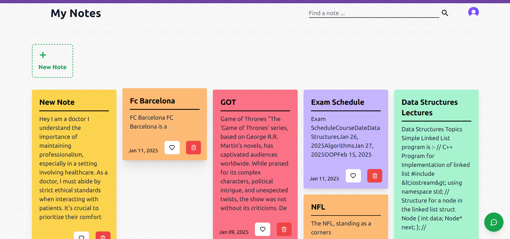

# NoteAssistant

## Description
A note taking website with AI features which lets you customize notes.

## Need
The vision for the project is to explore and learn new technologies, such as Next.js, Hugging Face, and others, while developing a highly customizable note-taking application that serves as a virtual sticky notes board. Our goal is to integrate AI-driven features to enhance the user experience, streamline workflows, and minimize the time spent searching for information.

## Features
1. Color coding notes to distinguish between tasks, ability to upload cover images or generate using AI for customization. 
2. Authentication to make sure of privacy.
3. Adding Tables and Code Blocks with Syntax highlighting for tabularization and supporting coding in multiple languages.
4. Chatbot to answer questions based on your notes for quick information check saving valuable time.
5. Searching notes based on title as well as content reducing lookup time.
6. Autocompletion of text based on your last text input.
7. Made application responsive and Shortcut support increasing accesibility and ease of usage
8. Adding favorites to make notes easily accesible.

## Tech Stack
- UI/Backend :- Next.JS, Tailwind CSS, Material UI, Prisma Client
- Database :- MongoDB, PineCone,
- AI :- Huggingface Inference API
- Cloud Data Storage :- Upload Thing
- Authentication :- Clerk Auth

## Execute the project
1. Install packages
- npm i or npm i --force (if failing due version mismatch)

2. Command to initialize prisma client (Do it after each change in the schema)
- npx prisma generate

3. Commands to run 
- npm run dev
- site hosted on http://localhost:3000

## Screenshots
#### Dashboard

#### Create notes

#### Chatbot

#### Cover Image Generation

#### Code Block 

#### 

